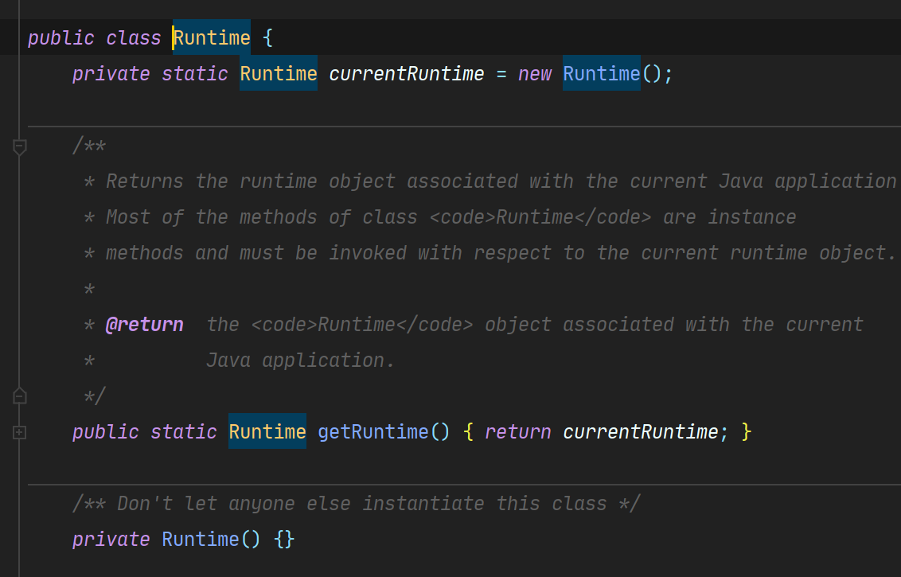

# 创建型设计模式之单例设计模式

### 1.单例的定义

**单例模式（单间模式）:**确保一个类只有一个实例，并提供一个全局的访问点。

### 2.单例的由来

#### 2.1 产生原因

就是说很多重要的对象，整个程序的全局中只需要一个就行了，比如线程池、缓存、注册表等等对象。如果说你 new 了多个这种对象，就会导致程序异常或者说是意想不到的结果。

#### 2.2 形象比喻

就拿我们自己的屋子比作一个程序，屋子里的任何东西都想象成对象。那你就该想到屋子里有一些的对象只要有一个就行了，往大了说一个厨房、一个浴室，往小了说马桶、椅子。就拿这个马桶来说事，我们上厕所就得利用厕所中用马桶这个对象 ，而不是想在哪 new 个马桶对象就在哪 new

#### 2.3 替代方法以及为何不使用替代的方法

大家这边或许有疑问，那我们大家**约定**好使用这些重要对象的注意事项，或者我们大家使用静态的**全局变量**，

不是可以替代上面的单例设计模式吗？？？

##### 2.3.1 解答

首先，大家一起约定好不现实，一个系统总会有换人的时候，总会有断档的时候，有时候口头上的约定不如代码来的现实。其次，全局变量确实可以做到这一点，但如果说系统从头到尾都没有使用这个全局变量，就会产生浪费资源的情况。当然，用的好的话，全局的静态变量、静态方法那是可以用的。只不过多了解一个设计模式不是更好吗！！！

### 3.单例的代码

#### 3.1**饿汉式（静态常量）**

实现步骤:

- 构造器私有化 (防止 new )
- 类的内部创建对象
- 向外暴露一个静态的公共方法 getInstance （）

```java
public class SingletonType1 {

    private SingletonType1() {}

    private final static SingletonType1 instance = new SingletonType1();

    public SingletonType1 getInstance(){
        return instance;
    }
}
```

**优缺点：**

- 优点：这种写法比较简单，就是在类装载的时候就完成实例化。避免了线程同 步问题。
- 缺点：
  - 在类装载的时候就完成实例化，没有达到 Lazy Loading 的效果。如果从始 至终从未使用过这个实例，则会造成内存的浪费
  - 这种方式基于 classloder 机制避免了多线程的同步问题，不过，instance 在类装载 时就实例化，在单例模式中大多数都是调用 getInstance 方法， 但是导致类装载 的原因有很多种，因此不能确定有其他的方式（或者其他的静态方法）导致类 装载，这时候初始化 instance 就没有达到 lazy loading 的效果
- 结论：这种单例模式可用，可能造成内存浪费

#### 3.2**饿汉式（静态代码块）**

```java
public class SingletonType2 {
    private static SingletonType2 instance;
    static {
        instance  = new SingletonType2();
    }
    private SingletonType2(){}

    public static SingletonType2 getInstance(){
        return instance;
    }
}
```

**优缺点说明：**这种方式和上面的方式其实类似，只不过将类实例化的过程放在了静态代码块 中，也是在类装载的时候，就执行静态代码块中的代码，初始化类的实例。优缺点和上面是一样的。

**结论：**这种单例模式可用，但是可能造成内存浪费

#### 3.3**懒汉式线程不安全**

```java
package singleton;

/**
 * @author DAYANG
 * @ClassName Singleton
 * @Description
 * @Date 2021/6/30 23:17
 * @Version 1.0.0
 **/

//延迟加载的原生的单例的设计模式
public class Singleton {
    public static Singleton singleton;

    private Singleton() {
    }

    public static Singleton getInstance() {
        if (singleton == null) {
            singleton = new Singleton();
        }
        return singleton;
    }

}

```

##### 3.1.1 原理

- 想要只有一个对象--->其他地方不能 new 这个对象--->**把构造器私有化**
- 构造器私有化后这个对象如何产生--->自己内部产生
- 如何给外部提供对象--->用一个静态的方法和静态的变量，静态方法用于产生对象，静态的变量用于承载这个对象
- 外部对象如何获得--->通过类名直接调用这个静态的方法获得这个对象。

##### 3.1.2 介绍与问题

简介：这是一个延迟加载的设计模式，只有调用才会产生这个对象

问题：资源只有一个资源，当有多个线程同时访问这个静态的方法的时候，就会产生同步的问题。最不能容忍的就是多线程调用方法产生的对象不是同一个对象，那这个单例类就失去了意义。

##### 3.1.3 解决多线程的问题

- 方式一：加一个同步锁 synchronized，想一想这样就出现了俩个问题。第一就是慢，第二就是这边也不是每次都要同步，也就是生成对象的那第一次需要同步，其他的时候都不会产生多线程的问题。

#### 3.4**懒汉式线程安全（同步方法）**

**代码：**

```java
public class SingletonType4 {
    public static SingletonType4 singleton;

    private SingletonType4() {
    }

    public static synchronized SingletonType4 getInstance() {
        if (singleton == null) {
            singleton = new SingletonType4();
        }
        return singleton;
    }
}
```

**优缺点说明：**

- 解决了线程不安全问题
- 效率太低了，每个线程在想获得类的实例时候，执行 getInstance()方法都要进行 同步。而其实这个方法只执行一次实例化代码就够了，后面的想获得该类实例， 直接 return 就行了。方法进行同步效率太低
- 结论：**在实际开发中，不推荐使用这种方式**

#### 3.5**懒汉式线程安全（同步代码块）**

**代码：**

```java
public class SingletonType5 {
    public static SingletonType5 singleton;

    private SingletonType5() {
    }

    public static SingletonType5 getInstance() {
        if (singleton == null) {
            synchronized (SingletonType5.class) {
                singleton = new SingletonType5();
            }
        }
        return singleton;
    }
}

```

**优缺点说明：**

- 这种方式，本意是想对第四种实现方式的改进，因为前面同步方法效率太低， 改为同步产生实例化的的代码块
- 但是这种同步并不能起到线程同步的作用。跟第 3 种实现方式遇到的情形一 致，假如一个线程进入了 if (singleton == null)判断语句块，还未来得及往下执行， 另一个线程也通过了这个判断语句，这时便会产生多个实例
- 结论：**在实际开发中，不能使用这种方式**

#### 3.6**懒汉式线程安全（双重检查）**

**代码：**

```java
public class SingletonType6 {
    public static SingletonType6 singleton;

    private SingletonType6() {
    }

    public static SingletonType6 getInstance() {
        if (singleton == null) {
            synchronized (SingletonType6.class) {
                if (singleton == null) {
                    singleton = new SingletonType6();
                }
            }
        }
        return singleton;
    }
}
```

**优缺点说明：**

- Double-Check 概念是多线程开发中常使用到的，如代码中所示，我们进行了两 次 if (singleton == null)检查，这样就可以保证线程安全了。
- 这样，实例化代码只用执行一次，后面再次访问时，判断 if (singleton == null)， 直接 return 实例化对象，也避免的反复进行方法同步.
- 线程安全；延迟加载；效率较高
- 结论：**在实际开发中，推荐使用这种单例设计模式**

#### 3.7**懒汉式线程安全（静态内部类）**

**代码：**

```java
public class SingletonType7 {
    private SingletonType7() {}

    private static class SingletonInstance{
        private static final SingletonType7 instance = new SingletonType7();
    }

    public SingletonType7 getInstance(){
        return SingletonInstance.instance;
    }
}

```

**优缺点说明：**

- 这种方式采用了类装载的机制来保证初始化实例时只有一个线程。
- 静态内部类方式在 Singleton 类被装载时并不会立即实例化，而是在需要实例化 时，调用 getInstance 方法，才会装载 SingletonInstance 类，从而完成 Singleton 的 实例化,**相较于饿汉式效率较高**
- 类的静态属性只会在第一次加载类的时候初始化，所以在这里，JVM 帮助我们 保证了线程的安全性，在类进行初始化时，别的线程是无法进入的。
- 优点：避免了线程不安全，利用静态内部类特点实现延迟加载，效率高
- 结论：**推荐使用**

#### 3.8**通过枚举的方式实现单例**

**代码：**

```java
public class SingletonType8 {
    public static void main(String[] args) {
        Singleton instance1 = Singleton.INSTANCE;
        Singleton instance2 = Singleton.INSTANCE;
        System.out.println(instance1 == instance2);
    }
}
enum Singleton{
 INSTANCE;
}
```

**优缺点说明：**

- 这借助 JDK1.5 中添加的枚举来实现单例模式。不仅能避免多线程同步问题，而 且还能**防止反序列化重新创建新的对象**。
- 这种方式是 Effective Java 作者 Josh Bloch **提倡的方式**
- 结论：**推荐使用**

#### 4.jdk 中的使用

**java.lang.Runtime 就是经典的单例模式(饿汉式)**



#### 5.总结

**单例模式注意事项和细节说明**

- 单例模式保证了 系统内存中该类只存在一个对象，节省了系统资源，**对于一些需 要频繁创建销毁的对象**，使用单例模式可以提高系统性能
- 当想实例化一个单例类的时候，必须要记住使用相应的获取对象的方法，而不是使 用 new
- 单例模式使用的场景：需要频繁的进行创建和销毁的对象、创建对象时耗时过多或 耗费资源过多(即：**重量级对象**)，但又经常用到的对象、工具类对象、频繁访问数 据库或文件的对象(比如数据源、session 工厂等)

**单例模式各种不同实现方式的使用推荐**（加粗的表示推荐）

- **_饿汉式(静态常量)_**
- **_饿汉式（静态代码块）_**
- 懒汉式(线程不安全)
- 懒汉式(线程安全，同步方法)
- 懒汉式(线程安全，同步代码块)
- **_双重检查_**
- **_静态内部类_**
- **_枚举_**
