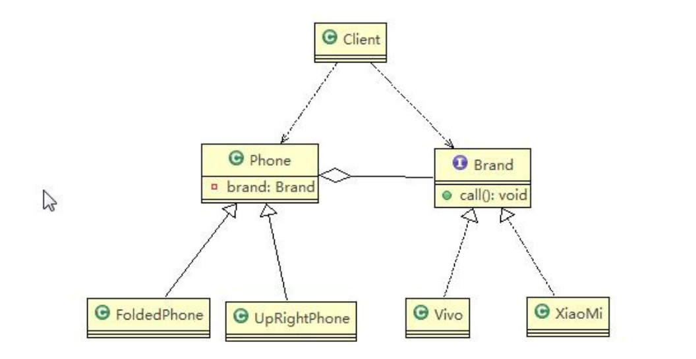

# 结构型-桥接模式

> 学习：B站尚硅谷设计模式视频  以及虫洞栈 https://bugstack.cn/

## 定义

**抽象部分与实现部分分离**，通过**组合**的方式来实现多种场景。

从下面俩张类图的变化可以显而易见的看出类的数量是变少的

> 图片来字b站尚硅谷设计模式

## 简单理解

1. 将原来m*n个实现类，变成了m+n个类

2. 通过**组合**的方式来完成

3. A类型中组合了B类型

## 实现

需要将类拆分成俩种变化的角度

## 运用

- jdbc连接技术

