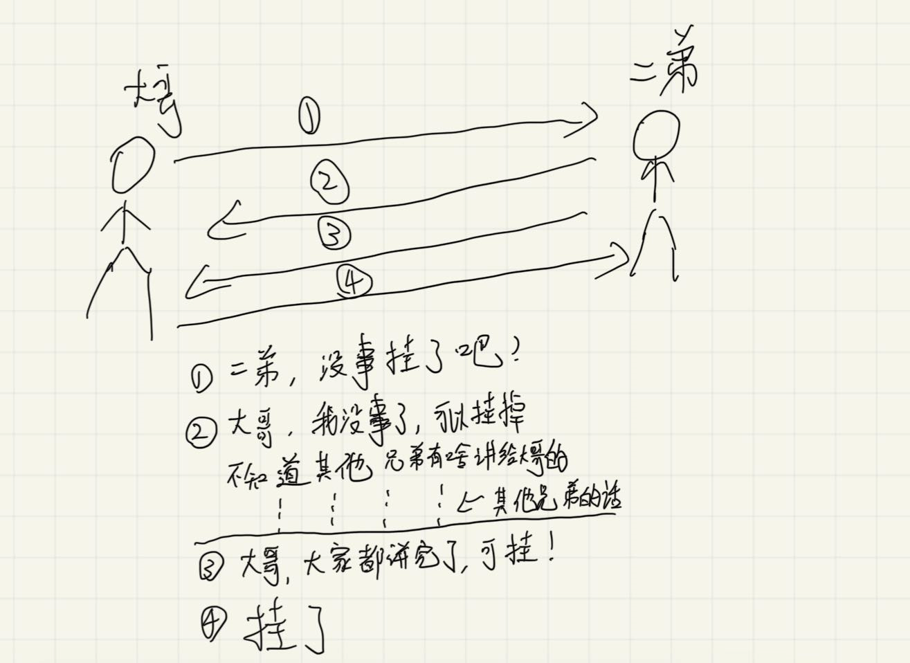

# 网络常见面试题

## TCP三次握手和四次挥手

### 三次握手

为了在不可靠的网络信道中建立可靠的连接

**主要是确认**：在客户端和服务端每一端，都要确认自己的发送接收能力，另一端的发送接收能力有没有问题。

- 第一次握手
  - 服务端确认客户端能发送能力没问题
  - 服务端确认自己的接收能力没问题
- 第二次握手
  - 客户端确认服务端接收能力没问题
  - 客户端确认服务端发送能力没问题
  - 自己的发送能力没有问题
  - 自己的接收能力没有问题
- 第三次握手
  - 服务端确认客户端的接收能力没有问题
  - 自己的发送能力没有问题

|            | 客户端     |            |            |            | 服务端     |            |            |            |
| ---------- | ---------- | ---------- | ---------- | ---------- | ---------- | ---------- | ---------- | ---------- |
|            | 客户端发送 | 客户端接收 | 服务端发送 | 服务端接收 | 服务端发送 | 服务端接收 | 客户端发送 | 客户端接收 |
| 第一次握手 |            |            |            |            |            | 1          | 1          |            |
| 第二次握手 | 1          | 1          | 1          | 1          |            |            |            |            |
| 第三次握手 |            |            |            |            | 1          |            |            | 1          |
| 综上       | 1          | 1          | 1          | 1          | 1          | 1          | 1          | 1          |

#### 第三次握手的作用

假设客户端第一次发送的syn包阻塞在了网络环境中，又发了一次syn包给服务端，服务端通过俩次握手建立连接，这时第一次syn包也到达了服务端，服务端认为这个是建立了一个新的连接，再次等待客户端的ask。那么这就导致俩边状态不一致，客户端认为是一个连接，服务端认为是俩个连接

### 四次挥手

通过四次挥手断开连接。

- 客户端给服务端发送fin包
- 服务端发送ask包
  - 一些还没有发送给客户端的请求继续发送
- 服务端发送fin包
- 客户端发送ask包

## TCP/UDP协议

#### TCP

文件、右键、浏览网页

- 稳定
- 性能损耗高

#### UDP

语音通话、视频直播

- 不稳定
- 性能损耗小
- 资源占用小
- 速度快

> 参考

https://pdai.tech/md/develop/protocol/dev-protocol-tcpip.html

https://zhuanlan.zhihu.com/p/290651392

https://zhuanlan.zhihu.com/p/53374516

https://www.bilibili.com/video/BV1kV411j7hA/?spm_id_from=333.788.recommend_more_video.-1&vd_source=c71d09e2b760789997b8bd809459def5