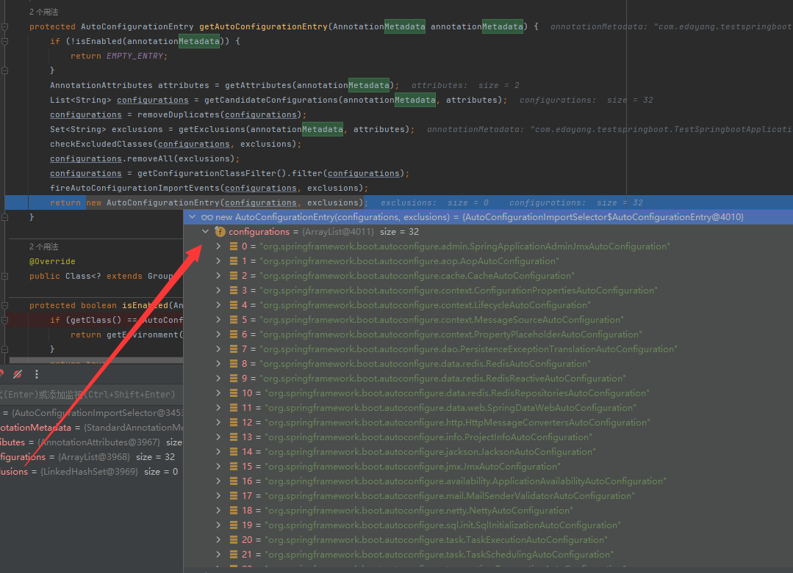
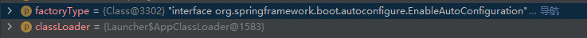
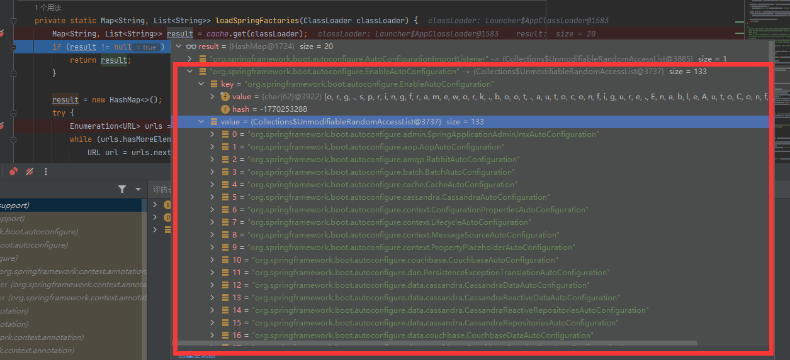
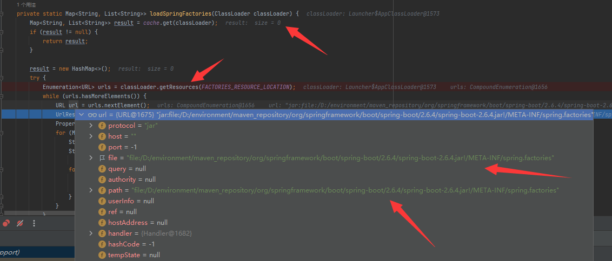

# SpringBoot 自动装配原理浅究

很多人都看过了也都写了文章，有时候自己看看也会有不一样的收获 ，当前查看源码的 springboot 2.6.4

## 看代码前需要了解的知识

### @Import 注解和 ImportSelector.java 类

- @Import(XXXX.class)注解就是导入一个 bean,它比@Bean 高级。

- @Import 可以和 ImportSelector.java 配合使用用于导入 ImportSelector 类中的 selectImports 方法的返回的 String 数组的类。

## 从根子上看

网上的帖子都说是`AutoConfigurationImportSelector`这个类在起到自动装配的作用，他会拿到`META-INF`文件夹中的`Spring.factories`中的全限定的类名，直接打断点，看源码。

### EnableAutoConfiguration 注解

这边的意思就是说将 AutoConfigurationImportSelector 这个类导入 Spring 容器，然后调用 AutoConfigurationImportSelector 中的`selectImports`方法，然后导入 bean。

```java
@Target(ElementType.TYPE)
@Retention(RetentionPolicy.RUNTIME)
@Documented
@Inherited
@AutoConfigurationPackage
@Import(AutoConfigurationImportSelector.class)
public @interface EnableAutoConfiguration {
```

### AutoConfigurationImportSelector 类

<font color='red'>一条龙，顺着调用链路挨个方法看</font>

#### selectImports 方法

这个方法打断点打不进来，<font color='green'>严重怀疑是非正常手段调用的这个方法</font>。这块留有悬念。

```java
@Override
public String[] selectImports(AnnotationMetadata annotationMetadata) {
    //查看是否开启了自动配置
   if (!isEnabled(annotationMetadata)) {
      return NO_IMPORTS;
   }
    //获得AutoConfigurationEntry。
   AutoConfigurationEntry autoConfigurationEntry = getAutoConfigurationEntry(annotationMetadata);
    //将里面的全限定类名的list变成String数组
   return StringUtils.toStringArray(autoConfigurationEntry.getConfigurations());
}
```

##### isEnabled 方法

<font color='red'>不是很能理解把这个注解 metadata 传进来是干啥用的，传进来也没用到</font>

```java
protected boolean isEnabled(AnnotationMetadata metadata) {
   if (getClass() == AutoConfigurationImportSelector.class) {
       //spring.boot.enableautoconfiguration 这边默认是返回true 表示开启
      return getEnvironment().getProperty(EnableAutoConfiguration.ENABLED_OVERRIDE_PROPERTY, Boolean.class, true);
   }
   return true;
}
```

##### getAutoConfigurationEntry 方法

```java
	/**
	 * Return the {@link AutoConfigurationEntry} based on the {@link AnnotationMetadata}
	 * of the importing {@link Configuration @Configuration} class.
	 * @param annotationMetadata the annotation metadata of the configuration class
	 * @return the auto-configurations that should be imported
	 */
	protected AutoConfigurationEntry getAutoConfigurationEntry(AnnotationMetadata annotationMetadata) {
        //AutoConfigurationEntry
		if (!isEnabled(annotationMetadata)) {
            //返回了new了一个AutoConfigurationEntry对象
			return EMPTY_ENTRY;
		}
        //获得注解的属性
		AnnotationAttributes attributes = getAttributes(annotationMetadata);
        //获得所有的全限定的类名
		List<String> configurations = getCandidateConfigurations(annotationMetadata, attributes);
        //去重
		configurations = removeDuplicates(configurations);
        //过滤
		Set<String> exclusions = getExclusions(annotationMetadata, attributes);
		checkExcludedClasses(configurations, exclusions);
		configurations.removeAll(exclusions);
		configurations = getConfigurationClassFilter().filter(configurations);
		fireAutoConAutoConfigurationEntry返回figurationImportEvents(configurations, exclusions);
        //封装进AutoConfigurationEntry返回
		return new AutoConfigurationEntry返回(configurations, exclusions);
	}
```

AutoConfigurationEntry 其实就是一个类，封装了一个 list,里面是<font color='red'>类的全限定名</font>



### 疑问如何拿到 META-INF 中的全限定的类名

#### getCandidateConfigurations 方法

```java
	/**
	 * Return the auto-configuration class names that should be considered. By default
	 * this method will load candidates using {@link SpringFactoriesLoader} with
	 * {@link #getSpringFactoriesLoaderFactoryClass()}.
	 * @param metadata the source metadata
	 * @param attributes the {@link #getAttributes(AnnotationMetadata) annotation
	 * attributes}
	 * @return a list of candidate configurations
	 */
	protected List<String> getCandidateConfigurations(AnnotationMetadata metadata, AnnotationAttributes attributes) {
        //关键是这个方法
        //getSpringFactoriesLoaderFactoryClass()
        //传的是interface org.springframework.boot.autoconfigure.EnableAutoConfiguration

        //getBeanClassLoader() 传的是 AppClassLoader
		List<String> configurations = SpringFactoriesLoader.loadFactoryNames(getSpringFactoriesLoaderFactoryClass(),
				getBeanClassLoader());
		Assert.notEmpty(configurations, "No auto configuration classes found in META-INF/spring.factories. If you "
				+ "are using a custom packaging, make sure that file is correct.");
		return configurations;
	}

```

#### loadFactoryNames 方法

```java
/**
	 * Load the fully qualified class names of factory implementations of the
	 * given type from {@value #FACTORIES_RESOURCE_LOCATION}, using the given
	 * class loader.
	 * <p>As of Spring Framework 5.3, if a particular implementation class name
	 * is discovered more than once for the given factory type, duplicates will
	 * be ignored.
	 * @param factoryType the interface or abstract class representing the factory
	 * @param classLoader the ClassLoader to use for loading resources; can be
	 * {@code null} to use the default
	 * @throws IllegalArgumentException if an error occurs while loading factory names
	 * @see #loadFactories
	 */
	public static List<String> loadFactoryNames(Class<?> factoryType, @Nullable ClassLoader classLoader) {
		ClassLoader classLoaderToUse = classLoader;
		if (classLoaderToUse == null) {
			classLoaderToUse = SpringFactoriesLoader.class.getClassLoader();
		}
		String factoryTypeName = factoryType.getName();
		return loadSpringFactories(classLoaderToUse).getOrDefault(factoryTypeName, Collections.emptyList());
	}
```



#### loadSpringFactories 方法

<font color='red'>关键就是 classLoader.getResources 方法来获得路径</font>

看这个博客 [https://blog.csdn.net/zhangshk\_/article/details/82704010 ](https://blog.csdn.net/zhangshk_/article/details/82704010)

了解一下 classLoader.getResources 这个方法，这边涉及到类加载的双亲委派的机制

```java
	private static Map<String, List<String>> loadSpringFactories(ClassLoader classLoader) {
		Map<String, List<String>> result = cache.get(classLoader);
		if (result != null) {
			return result;
		}

		result = new HashMap<>();
		try {
            //关键
			Enumeration<URL> urls = classLoader.getResources(FACTORIES_RESOURCE_LOCATION);
			while (urls.hasMoreElements()) {
                //获得路径
				URL url = urls.nextElement();
                //包成Urlresource 访问资源用
				UrlResource resource = new UrlResource(url);
                //ok 这边就拿到了Spring.Factories文件
				Properties properties = PropertiesLoaderUtils.loadProperties(resource);
				for (Map.Entry<?, ?> entry : properties.entrySet()) {
					String factoryTypeName = ((String) entry.getKey()).trim();
					String[] factoryImplementationNames =
							StringUtils.commaDelimitedListToStringArray((String) entry.getValue());
					for (String factoryImplementationName : factoryImplementationNames) {
						result.computeIfAbsent(factoryTypeName, key -> new ArrayList<>())
								.add(factoryImplementationName.trim());
					}
				}
			}

			// Replace all lists with unmodifiable lists containing unique elements
			result.replaceAll((factoryType, implementations) -> implementations.stream().distinct()
					.collect(Collectors.collectingAndThen(Collectors.toList(), Collections::unmodifiableList)));
			cache.put(classLoader, result);
		}
		catch (IOException ex) {
			throw new IllegalArgumentException("Unable to load factories from location [" +
					FACTORIES_RESOURCE_LOCATION + "]", ex);
		}
		return result;
	}
```





## 总结

- 通过这个`@Import(AutoConfigurationImportSelector.class)`实现自动装配
- 主要问题就是如何找到 META-INF 中的 spring.factories 中的配置
- 通过 classloader.getResource 方法获得路径 --》加载资源--》拿到文件中的配置

## 从源头上看

主要是想看看从哪调用的上面 selectImport 方法，从 run 方法打断点进去。

到是遇到了彩蛋，AbstractApplicationContext.java 545 refresh() 有点 Bean 初始化那味。

参考：[https://blog.csdn.net/it_lihongmin/article/details/106955547](https://blog.csdn.net/it_lihongmin/article/details/106955547)

```java
1.SpringApplication.java 303  refreshContext()
2.AbstractApplicationContext.java 545 refresh()
3.AbstractApplicationContext.java 564 invokeBeanFactoryPostProcessors()
4.AbstractApplicationContext.java 746 PostProcessorRegistrationDelegate.invokeBeanFactoryPostProcessors()方法
5.PostProcessorRegistrationDelegate.java 112 invokeBeanDefinitionRegistryPostProcessors
6.PostProcessorRegistrationDelegate.java 311 postProcessor.postProcessBeanDefinitionRegistry()方法
7.ConfigurationClassPostProcessor.java 247 processConfigBeanDefinitions()方法
8.ConfigurationClassPostProcessor.java 331 parser.parse()方法
10.ConfigurationClassParser.java 175
11.ConfigurationClassParser.java 250 doProcessConfigurationClass(configClass, sourceClass, filter)方法
12.ConfigurationClassParser.java 250 processImports()方法
13.ConfigurationClassParser.java 758 this.deferredImportSelectorHandler.handle()方法
14.ConfigurationClassParser.java 193 this.deferredImportSelectorHandler.process()方法
15.ConfigurationClassParser.java 809 grouping.getImports()方法触发 selectImports（）方法
```

中间有的循环直接过滤，然后最后到 15 步才具体调用。

里面有的嵌套调用，看的麻了。留个 todo。

`ParserStrategyUtils.instantiateClass`里面有一个这个方法，挺好奇的。看了看英文说明，是一个根据 class 实例化对象的方法，会执行 Aware 结尾的接口，之前 AutoConfigurationImportSelector 这个类实现了好多这个接口。

```java
private Group createGroup(@Nullable Class<? extends Group> type) {
			Class<? extends Group> effectiveType = (type != null ? type : DefaultDeferredImportSelectorGroup.class);
			return ParserStrategyUtils.instantiateClass(effectiveType, Group.class,
					ConfigurationClassParser.this.environment,
					ConfigurationClassParser.this.resourceLoader,
					ConfigurationClassParser.this.registry);
		}
```

```java
	/**
	 * Instantiate a class using an appropriate constructor and return the new
	 * instance as the specified assignable type. The returned instance will
	 * have {@link BeanClassLoaderAware}, {@link BeanFactoryAware},
	 * {@link EnvironmentAware}, and {@link ResourceLoaderAware} contracts
	 * invoked if they are implemented by the given object.
	 * @since 5.2
	 */
	/**
	使用适当的构造函数实例化一个类，并返回新实例作为指定的可赋值类型。返回的实例将调用BeanClassLoaderAware、BeanFactoryAware、EnvironmentAware和ResourceLoaderAware契约(如果它们是由给定对象实现的)。Since: 5.2
	*/
	@SuppressWarnings("unchecked")
	static <T> T instantiateClass(Class<?> clazz, Class<T> assignableTo, Environment environment,
			ResourceLoader resourceLoader, BeanDefinitionRegistry registry) {

		Assert.notNull(clazz, "Class must not be null");
		Assert.isAssignable(assignableTo, clazz);
		if (clazz.isInterface()) {
			throw new BeanInstantiationException(clazz, "Specified class is an interface");
		}
		ClassLoader classLoader = (registry instanceof ConfigurableBeanFactory ?
				((ConfigurableBeanFactory) registry).getBeanClassLoader() : resourceLoader.getClassLoader());
		T instance = (T) createInstance(clazz, environment, resourceLoader, registry, classLoader);
		ParserStrategyUtils.invokeAwareMethods(instance, environment, resourceLoader, registry, classLoader);
		return instance;
	}
```

## 参考

[https://cloud.tencent.com/developer/article/2046636](https://cloud.tencent.com/developer/article/2046636)

[https://blog.csdn.net/qq_45673367/article/details/118700598](https://blog.csdn.net/qq_45673367/article/details/118700598)

[https://blog.csdn.net/u012420654/article/details/52668812](https://blog.csdn.net/u012420654/article/details/52668812)

[https://blog.csdn.net/Taylar_where/article/details/90547570](https://blog.csdn.net/Taylar_where/article/details/90547570)

[https://blog.csdn.net/andy_zhang2007/article/details/78549773](https://blog.csdn.net/andy_zhang2007/article/details/78549773)

[https://blog.csdn.net/Leehom_Wang/article/details/105446029](https://blog.csdn.net/Leehom_Wang/article/details/105446029)

[https://cloud.tencent.com/developer/article/1499588](https://cloud.tencent.com/developer/article/1499588)

[https://blog.csdn.net/zhangshk\_/article/details/82704010](https://blog.csdn.net/zhangshk_/article/details/82704010)

[https://blog.csdn.net/it_lihongmin/article/details/106955547](https://blog.csdn.net/it_lihongmin/article/details/106955547)
